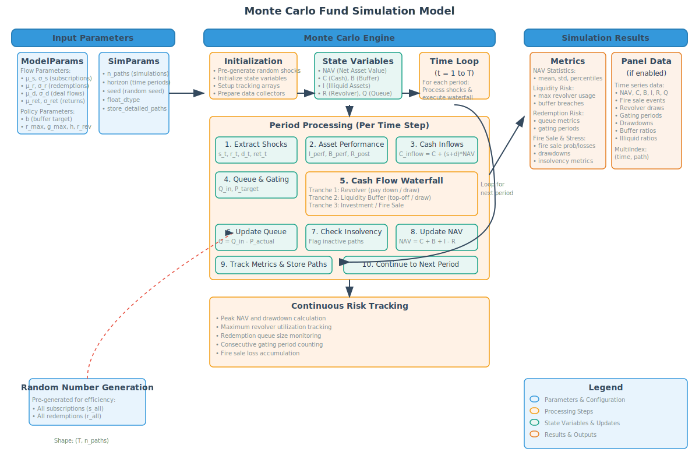

# Liquidity Simulation Prototype

A sophisticated Monte Carlo simulation engine for analyzing liquidity dynamics and risk management in evergreen private equity funds and semi-liquid alternative investment vehicles. [Link to Jupyter Notebook.](liquidity_sim.ipynb) 

## Overview

This project implements a Monte Carlo simulation to model and analyze the liquidity dynamics of an evergreen-style private equity fund. The simulation accounts for various factors including subscriptions, redemptions, deal cash flows, and asset performance to help understand and optimize fund liquidity management.

## Key Features

- Monte Carlo simulation of fund liquidity dynamics
- Comprehensive state variable tracking (Cash, Liquid Buffer, Illiquid Assets, NAV, etc.)
- Stochastic modeling of key variables:
  - Subscriptions
  - Redemption requests
  - Net deal cash flows
  - Illiquid asset returns
- Sophisticated cash flow waterfall implementation
- Queue-based gating mechanism
- Revolver debt management
- Liquidity sleeve optimization

## Model Components

### State Variables
- Cash in operating account
- Liquid sleeve (T-bills/money-market)
- Illiquid assets
- Net Asset Value (NAV)
- Revolver balance
- Redemption queue
- Liquidity sleeve target
- Revolver gate limit

### Stochastic Processes
The model incorporates several stochastic processes using appropriate distributions:
- LogNormal distributions for subscriptions and redemptions
- Normal distribution for net deal cash flows
- LogNormal distribution for illiquid returns

Future extensions choose more flexible statistical distributions, potentially driven
by another system (Macroeconomy -> Market Factors -> Fund Flows -> Fund Waterfall Dynamics)

## Getting Started

### Prerequisites
- Python 3.x
- Jupyter Notebook
- Required Python packages (to be added to requirements.txt)

### Installation
1. Clone this repository
2. Install required dependencies
3. Open [liquidity_sim.ipynb](liquidity_sim.ipynb) in Jupyter Notebook

## Usage

The simulation is implemented in a Jupyter notebook ([liquidity_sim.ipynb](liquidity_sim.ipynb)). The notebook contains:
- Detailed model documentation
- Implementation of the simulation logic using Pydantic for data validation
- Visualization of results
- Analysis of key metrics

## Model Workflow

1. Asset Performance & Interest Accrual
2. Cash Flow Processing
3. Queue-based Gating
4. Cash Flow Waterfall Implementation
   - Surplus Management
   - Revolver Debt Management
   - Liquidity Sleeve Optimization

## License

This project is licensed under the terms included in the LICENSE file.

## Author

David Leather

## Contributing

Contributions are welcome! Please feel free to submit a Pull Request. 